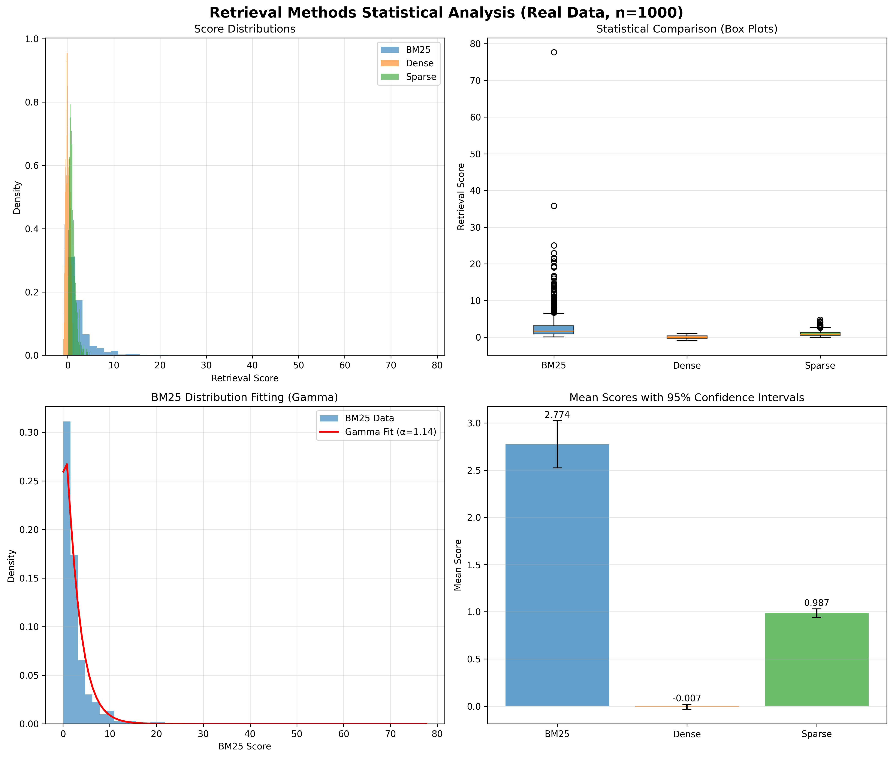
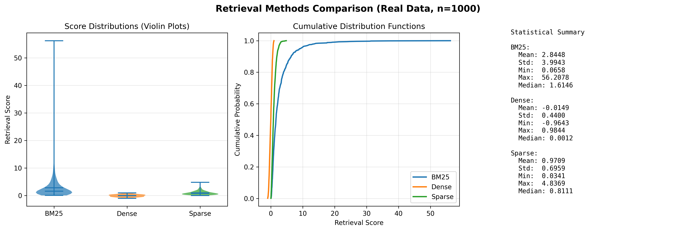

# rank-retrieve

First-stage retrieval for information retrieval pipelines. Provides BM25, dense ANN, and sparse retrieval.

[](https://github.com/arclabs561/rank-rank/actions)
[](https://crates.io/crates/rank-retrieve)
[](https://docs.rs/rank-retrieve)
[](https://github.com/arclabs561/rank-rank/blob/main/LICENSE)
[](https://github.com/arclabs561/rank-rank)

```
cargo add rank-retrieve
```

## Documentation

- [Getting Started](docs/GETTING_STARTED.md) | [End-to-End Guide](#end-to-end-usage-guide) | [Use Cases](docs/USE_CASES.md)
- [RAG Guide](docs/RAG_GUIDE.md) | [Late Interaction](docs/LATE_INTERACTION_GUIDE.md) | [Filtering](docs/FILTERING_IN_VECTOR_SEARCH.md)
- [Examples](examples/) | [API Docs](https://docs.rs/rank-retrieve)

## Overview

Retrieval library (not a vector database). First stage of ranking pipeline: 10M docs → 1000 candidates.

```
10M docs → 1000 candidates → 100 candidates → 10 results
    │            │                 │              │
    ▼            ▼                 ▼              ▼
[retrieve]   [rerank]         [cross-encoder]   [User]
```

**When to use**: IR pipelines, prototyping, single-node deployments, unified API for multiple methods.  
**When not**: Need persistence, distributed systems, or full vector database features. See [VECTOR_DATABASE_INTEGRATION.md](docs/VECTOR_DATABASE_INTEGRATION.md).

## Features

- BM25, TF-IDF, dense, sparse retrieval
- 15 ANN algorithms (HNSW, IVF-PQ, DiskANN, SCANN, etc.)
- Metadata filtering and faceting
- SIMD-accelerated

See [ANN Algorithm Selection Guide](#ann-algorithm-selection-guide) for algorithm selection.

## Quick Start

### BM25 Retrieval

```rust
use rank_retrieve::{retrieve_bm25};
use rank_retrieve::bm25::{Bm25Params, InvertedIndex};

let mut index = InvertedIndex::new();

// Add documents
index.add_document(0, &["the".to_string(), "quick".to_string(), "brown".to_string()]);
index.add_document(1, &["the".to_string(), "lazy".to_string(), "dog".to_string()]);

// Standard BM25
let query = vec!["quick".to_string()];
let results = retrieve_bm25(&index, &query, 10, Bm25Params::default())?;

// BM25L (for long documents)
let bm25l_results = retrieve_bm25(&index, &query, 10, Bm25Params::bm25l())?;

// BM25+ (prevents negative scores)
let bm25plus_results = retrieve_bm25(&index, &query, 10, Bm25Params::bm25plus())?;

// Results: [(doc_id, score), ...]
for (doc_id, score) in results {
    println!("Doc {}: {:.4}", doc_id, score);
}
```

### Query Expansion / PRF

Add `rank-retrieve = { version = "0.1", features = ["bm25", "query-expansion"] }` to your `Cargo.toml`.

```rust
use rank_retrieve::query_expansion::{expand_query_with_prf_bm25, QueryExpander};
use rank_retrieve::bm25::{Bm25Params, InvertedIndex};
use rank_retrieve::retrieve_bm25;

let mut index = InvertedIndex::new();
index.add_document(0, &["machine".to_string(), "learning".to_string()]);

let query = vec!["ml".to_string()];  // Abbreviated query
let expander = QueryExpander::new()
    .with_prf_depth(5)
    .with_max_expansion_terms(5);

// PRF expands "ml" to include "machine", "learning" from top docs
let results = expand_query_with_prf_bm25(&index, &query, 10, 10, &expander, retrieve_bm25)?;
```

### Query Likelihood / Language Models

Add `rank-retrieve = { version = "0.1", features = ["bm25", "query-likelihood"] }` to your `Cargo.toml`.

```rust
use rank_retrieve::query_likelihood::{retrieve_query_likelihood, QueryLikelihoodParams, SmoothingMethod};
use rank_retrieve::bm25::InvertedIndex;

let mut index = InvertedIndex::new();
index.add_document(0, &["machine".to_string(), "learning".to_string()]);

let query = vec!["machine".to_string(), "learning".to_string()];
let params = QueryLikelihoodParams {
    smoothing: SmoothingMethod::Dirichlet { mu: 1000.0 },
};
let results = retrieve_query_likelihood(&index, &query, 10, params)?;
```

### TF-IDF Retrieval

Add `rank-retrieve = { version = "0.1", features = ["tfidf"] }` to your `Cargo.toml`.

```rust
use rank_retrieve::{retrieve_tfidf};
use rank_retrieve::bm25::InvertedIndex;
use rank_retrieve::tfidf::TfIdfParams;

let mut index = InvertedIndex::new();

// Add documents (reuses BM25 index structure)
index.add_document(0, &["machine".to_string(), "learning".to_string()]);
index.add_document(1, &["artificial".to_string(), "intelligence".to_string()]);

// Query using TF-IDF
let query = vec!["machine".to_string()];
let results = retrieve_tfidf(&index, &query, 10, TfIdfParams::default())?;

// Results: [(doc_id, score), ...]
for (doc_id, score) in results {
    println!("Doc {}: {:.4}", doc_id, score);
}
```

### Dense Retrieval

```rust
use rank_retrieve::{retrieve_dense};
use rank_retrieve::dense::DenseRetriever;

let mut retriever = DenseRetriever::new();

// Add documents with embeddings (should be L2-normalized)
retriever.add_document(0, vec![1.0, 0.0, 0.0]);
retriever.add_document(1, vec![0.707, 0.707, 0.0]);

// Query embedding using concrete function
let query = [1.0, 0.0, 0.0];
let results = retrieve_dense(&retriever, &query, 10)?;
```

### Sparse Retrieval

```rust
use rank_retrieve::{retrieve_sparse};
use rank_retrieve::sparse::{SparseRetriever, SparseVector};

let mut retriever = SparseRetriever::new();

// Add documents with sparse vectors
let doc0 = SparseVector::new_unchecked(vec![0, 1, 2], vec![1.0, 0.5, 0.3]);
retriever.add_document(0, doc0);

// Query sparse vector using concrete function
let query = SparseVector::new_unchecked(vec![0, 1], vec![1.0, 1.0]);
let results = retrieve_sparse(&retriever, &query, 10)?;
```

## Supported Distance Functions

rank-retrieve supports different distance functions depending on the retrieval method:

### Dense Retrieval
- **Cosine Similarity**: Default, L2-normalized vectors
- **Euclidean Distance**: Via `distance` parameter
- **Inner Product**: Via `distance` parameter

### Sparse Retrieval
- **Dot Product**: Default for sparse vectors

### BM25/TF-IDF
- **BM25 Score**: Not a distance function, but similarity score
- **TF-IDF Score**: Similarity score

**Note**: Not all ANN algorithms support all distance functions. HNSW supports cosine/Euclidean, while IVF-PQ typically uses Euclidean. See algorithm-specific documentation for details.

## ANN Algorithm Selection Guide

Based on the vector database survey's categorization, here's guidance for choosing the right algorithm:

### High-Dimensional Embeddings (d > 100)
- **Recommended**: HNSW, OPT-SNG, SCANN (Anisotropic VQ + k-means), IVF-PQ
- **Why**: Graph-based and quantization methods handle high dimensions well
- **Trade-off**: Higher memory (HNSW) vs. lower memory (IVF-PQ)

### Low-Dimensional Data (d < 20)
- **Recommended**: KD-Tree, Ball Tree
- **Why**: Space-partitioning trees excel at low dimensions
- **Trade-off**: Exact search possible, but degrades with dimension

### Medium-Dimensional Data (20 < d < 200)
- **Recommended**: K-Means Tree, Ball Tree, HNSW
- **Why**: K-Means Tree uses clustering instead of space partitioning, works well for medium dimensions
- **Trade-off**: K-Means Tree has good recall for medium dimensions, faster than brute-force but slower than HNSW

### Very Large Datasets (Billion-scale, B-scale)
- **Recommended**: IVF-PQ, DiskANN, SCANN
- **Why**: Quantization reduces memory footprint significantly
- **Trade-off**: Lower recall but enables billion-scale (1B+) on single machines
- **Note**: Using FAISS scale terminology: M=million, B=billion, T=trillion

### Streaming/Online Data
- **Recommended**: TurboQuant, LSH
- **Why**: Support incremental updates without full rebuild
- **Trade-off**: Slightly lower accuracy vs. batch methods

See [ANN_METHODS_SUMMARY.md](docs/ANN_METHODS_SUMMARY.md) for detailed comparisons and performance characteristics.

## Design

Concrete functions (`retrieve_bm25()`, `retrieve_dense()`, etc.) returning `Vec<(u32, f32)>`. Focuses on retrieval, not scoring (delegates to `rank-rerank`).

**Limitations:**
- In-memory only (no persistence)
- Single-threaded indexing
- Assumes pre-tokenized input
- No document storage (index only)
- Lightweight faceting (10K-100K docs)

**Scale:** Single-node, data fits in memory. For distributed systems, use vector databases or implement `Backend` trait.

## End-to-End Usage Guide

This section walks through a complete production-ready pipeline from setup to deployment.

**Realistic expectations:** A complete RAG pipeline (retrieval + LLM generation) typically takes 1-2 seconds in production. Retrieval alone (embedding + search + fusion + reranking) takes 100-300ms. LLM generation dominates latency at 800-2000ms for first token. These numbers are based on comprehensive production benchmarks and may vary based on infrastructure, model size, and query complexity.

### Step 1: Installation and Setup

Add dependencies to `Cargo.toml`:

```toml
[dependencies]
rank-retrieve = { version = "0.1", features = ["bm25", "dense", "sparse"] }
rank-fusion = "0.1"
rank-rerank = "0.1"
rank-eval = "0.1"
```

### Step 2: Build Indexes

Build indexes for each retrieval method you plan to use:

```rust
use rank_retrieve::bm25::{Bm25Params, InvertedIndex};
use rank_retrieve::dense::DenseRetriever;
use rank_retrieve::sparse::{SparseRetriever, SparseVector};

// BM25 index (for lexical matching)
let mut bm25_index = InvertedIndex::new();
for (doc_id, tokens) in documents.iter() {
    bm25_index.add_document(*doc_id, tokens);
}

// Dense index (for semantic search)
let mut dense_retriever = DenseRetriever::new();
for (doc_id, embedding) in embeddings.iter() {
    // Embeddings should be L2-normalized for cosine similarity
    dense_retriever.add_document(*doc_id, embedding.clone());
}

// Sparse index (for learned sparse retrieval, e.g., SPLADE)
let mut sparse_retriever = SparseRetriever::new();
for (doc_id, sparse_vec) in sparse_vectors.iter() {
    sparse_retriever.add_document(*doc_id, sparse_vec.clone());
}
```

**Production tip:** For large datasets, build indexes offline and load them at startup. Consider using vector databases (Qdrant, Milvus) for dense retrieval in production.

### Step 3: First-Stage Retrieval

Retrieve candidates from each method:

```rust
use rank_retrieve::{retrieve_bm25, retrieve_dense, retrieve_sparse};

// Prepare query
// Note: tokenize(), encode_query(), encode_sparse() are placeholders.
// In production, use proper tokenizers (tantivy, whatlang) and embedding models.
let query_terms = tokenize(&user_query);  // ["machine", "learning"]
let query_embedding = encode_query(&user_query)?;  // [0.1, 0.2, ...] (768-dim)
let query_sparse = encode_sparse(&user_query)?;  // SparseVector

// Retrieve top-k from each method
let k = 1000;  // Typical first-stage retrieval size
let bm25_results = retrieve_bm25(
    &bm25_index,
    &query_terms,
    k,
    Bm25Params::default()
)?;

let dense_results = retrieve_dense(
    &dense_retriever,
    &query_embedding,
    k
)?;

let sparse_results = retrieve_sparse(
    &sparse_retriever,
    &query_sparse,
    k
)?;

// Results: Vec<(u32, f32)> - (document_id, score)
```

**Performance (production benchmarks):**
- BM25: ~5-10ms baseline + 2.8ms per million documents (e.g., ~30ms for 8.8M docs)
- Dense (HNSW): ~30-50ms p50, ~50-80ms p95 for 1-10M vectors
- Dense (brute-force): O(n*d) - only suitable for <100K vectors
- Sparse: ~10-30ms depending on sparsity
- Hybrid (BM25 + Dense): ~110-160ms when optimized, ~140-250ms when sequential

### Step 4: Fusion (Combine Multiple Retrievers)

Fuse results from multiple retrieval methods:

```rust
use rank_fusion::{rrf_multi, RrfConfig};

// Combine BM25, dense, and sparse results
let fused = rrf_multi(
    &[&bm25_results, &dense_results, &sparse_results],
    RrfConfig {
        k: 60,  // RRF parameter (typical: 60)
        ..Default::default()
    }
);

// Fused results: Vec<(u32, f32)> sorted by combined score
// Take top candidates for reranking
let top_candidates: Vec<u32> = fused
    .iter()
    .take(100)  // Top 100 for reranking
    .map(|(id, _)| *id)
    .collect();
```

**Why fusion?** Different methods excel at different queries:
- BM25: Exact keyword matches
- Dense: Semantic similarity (handles synonyms, paraphrases)
- Sparse: Learned sparse representations (SPLADE, etc.)

**Performance:** RRF fusion takes <1ms for combining multiple result lists (typically 5-10ms even with complex result sets). The latency cost is primarily from parallel execution of retrieval methods, not the fusion algorithm itself.

### Step 5: Reranking (Precise Ranking)

Rerank top candidates using more expensive but accurate methods:

```rust
use rank_rerank::explain::{rerank_batch, Candidate, RerankMethod, RerankerInput};

// Prepare candidates with embeddings
let candidates: Vec<Candidate<u32>> = top_candidates
    .iter()
    .map(|&id| {
        let embedding = get_document_embedding(id);
        Candidate {
            id,
            original_score: fused.iter()
                .find(|(fid, _)| *fid == id)
                .map(|(_, score)| *score)
                .unwrap_or(0.0),
            dense_embedding: Some(embedding.as_slice()),
            token_embeddings: None,  // For MaxSim, provide token embeddings
            text: None,
        }
    })
    .collect();

// Rerank using dense similarity (or MaxSim for token-level matching)
let input = RerankerInput {
    query_dense: Some(&query_embedding),  // Note: field is query_dense, not query_embedding
    query_tokens: None,  // For MaxSim, provide query tokens
    candidates,  // Note: candidates is moved, not borrowed
};

// rerank_batch takes input, method, and top_k as separate parameters
let reranked = rerank_batch(input, RerankMethod::DenseCosine, 10);
// Returns Vec<RankedResult<u32>> with fields: id, score, original_score, rank
```

**Alternative: MaxSim (ColBERT-style) for token-level matching:**

```rust
use rank_rerank::simd;

// For MaxSim, you need token embeddings
let query_tokens = encode_query_tokens(&user_query)?;  // Vec<Vec<f32>>
let doc_tokens_list: Vec<Vec<Vec<f32>>> = top_candidates
    .iter()
    .map(|id| get_document_token_embeddings(*id))
    .collect();

let reranked = simd::maxsim_batch(&query_tokens, &doc_tokens_list);
```

**Performance (based on production benchmarks):**
- Dense reranking: ~10-50ms for 1000 → 100 candidates (CPU), ~5-20ms (GPU)
- MaxSim: ~50-100ms for 1000 → 100 candidates (CPU), ~10-30ms (GPU)
- Cross-encoder: ~50-200ms for 100 → 10 candidates (CPU), ~5-20ms (GPU)
- LLM-based reranking: ~900ms-5s for 40 candidates (with parallelization), sequential would be 5+ seconds

**Note:** These are reranking-only latencies. Full RAG pipeline includes LLM generation (800-2000ms TTFT), making total pipeline latency 1-2 seconds in production.

### Step 6: Evaluation (Optional)

Measure pipeline quality:

```rust
use rank_eval::binary::{ndcg_at_k, precision_at_k, recall_at_k};
use std::collections::HashSet;

// Get ground truth relevant documents
let relevant: HashSet<u32> = get_relevant_docs(&query_id);

// Extract ranked document IDs (reranked is Vec<RankedResult<u32>>)
let ranked: Vec<u32> = reranked.iter().map(|r| r.id).collect();

// Compute metrics (ndcg_at_k uses binary relevance by default)
let ndcg_10 = ndcg_at_k(&ranked, &relevant, 10);
let precision_10 = precision_at_k(&ranked, &relevant, 10);
let recall_10 = recall_at_k(&ranked, &relevant, 10);

println!("nDCG@10: {:.3}, P@10: {:.3}, R@10: {:.3}", 
    ndcg_10, precision_10, recall_10);
```

### Step 7: Complete Pipeline Example

Here's a complete end-to-end example:

```rust
use rank_retrieve::{retrieve_bm25, retrieve_dense, bm25::{Bm25Params, InvertedIndex}};
use rank_retrieve::dense::DenseRetriever;
use rank_fusion::{rrf, RrfConfig};
use rank_rerank::explain::{rerank_batch, Candidate, RerankMethod, RerankerInput};

fn search_pipeline(
    query: &str,
    bm25_index: &InvertedIndex,
    dense_retriever: &DenseRetriever,
) -> Result<Vec<(u32, f32)>, Box<dyn std::error::Error>> {
    // 1. Prepare query
    // Note: These are placeholder functions. In production, use:
    // - tokenize(): tantivy tokenizer or custom tokenizer
    // - encode_query(): Sentence transformers, OpenAI embeddings, etc.
    let query_terms = tokenize(query);
    let query_embedding = encode_query(query)?;
    
    // 2. Retrieve (first stage: 10M → 1000)
    let bm25_results = retrieve_bm25(
        bm25_index,
        &query_terms,
        1000,
        Bm25Params::default()
    )?;
    
    let dense_results = retrieve_dense(
        dense_retriever,
        &query_embedding,
        1000
    )?;
    
    // 3. Fuse results
    let fused = rrf(&bm25_results, &dense_results);
    
    // 4. Rerank top candidates (1000 → 10)
    let top_100: Vec<u32> = fused
        .iter()
        .take(100)
        .map(|(id, _)| *id)
        .collect();
    
    let candidates: Vec<Candidate<u32>> = top_100
        .iter()
        .map(|&id| Candidate {
            id,
            original_score: fused.iter()
                .find(|(fid, _)| *fid == id)
                .map(|(_, s)| *s)
                .unwrap_or(0.0),
            dense_embedding: Some(get_embedding(id).as_slice()),
            token_embeddings: None,
            text: None,
        })
        .collect();
    
    let input = RerankerInput {
        query_dense: Some(&query_embedding),  // Correct field name
        query_tokens: None,
        candidates,  // Move, not borrow
    };
    
    // rerank_batch signature: (input, method, top_k) -> Vec<RankedResult<K>>
    let reranked = rerank_batch(input, RerankMethod::DenseCosine, 10);
    
    // Convert RankedResult to (u32, f32) format if needed
    let results: Vec<(u32, f32)> = reranked.iter().map(|r| (r.id, r.score)).collect();
    Ok(results)
}
```

### Step 8: Production Considerations

**For production deployments:**

1. **Use vector databases for dense retrieval:**
   ```rust
   // Instead of in-memory DenseRetriever, use Qdrant/Milvus
   let dense_results = qdrant_client
       .search(&SearchPoints {
           collection_name: "documents".to_string(),
           vector: Some(query_embedding),
           limit: 1000,
           ..Default::default()
       })
       .await?;
   
   // Convert to rank-retrieve format
   let dense_results: Vec<(u32, f32)> = dense_results
       .result
       .into_iter()
       .map(|p| (p.id.num as u32, p.score as f32))
       .collect();
   ```

2. **Use Tantivy for BM25 (persistent, distributed):**
   ```rust
   // Build Tantivy index offline
   // Query at runtime
   let bm25_results = tantivy_index
       .search(&query_terms, 1000)?;
   ```

3. **Batch processing for multiple queries:**
   ```rust
   use rank_retrieve::batch;
   
   let queries = vec![query1, query2, query3];
   // Note: Batch functions process queries sequentially (not parallelized)
   // They're useful for reducing function call overhead, but don't provide
   // automatic parallelization. For true parallelism, use rayon or tokio.
   let results = batch::batch_retrieve_bm25(
       &bm25_index,
       &queries,
       1000,
       Bm25Params::default()
   )?;
   // Returns Vec<Vec<(u32, f32)>> - one result list per query
   ```

4. **Caching frequently accessed results:**
   ```rust
   // Cache query embeddings and retrieval results
   let cache_key = hash_query(&user_query);
   if let Some(cached) = cache.get(&cache_key) {
       return Ok(cached);
   }
   
   let results = search_pipeline(&user_query, ...)?;
   cache.insert(cache_key, results.clone());
   Ok(results)
   ```

5. **Error handling:**
   ```rust
   use rank_retrieve::RetrieveError;
   
   match retrieve_bm25(&index, &query, 1000, params) {
       Ok(results) => Ok(results),
       Err(RetrieveError::EmptyIndex) => {
           // Handle empty index (no documents indexed)
           Ok(vec![])
       },
       Err(RetrieveError::EmptyQuery) => {
           // Handle empty query (no query terms provided)
           Err("Query is empty".into())
       },
       Err(RetrieveError::DimensionMismatch { query_dim, doc_dim }) => {
           // Handle dimension mismatch (dense retrieval)
           Err(format!("Query dimension {} doesn't match document dimension {}", 
               query_dim, doc_dim).into())
       },
       Err(RetrieveError::InvalidParameter(msg)) => {
           // Handle invalid parameter
           Err(format!("Invalid parameter: {}", msg).into())
       },
       Err(e) => Err(e.into()),
   }
   ```

### Performance Benchmarks

**Realistic production performance** (based on comprehensive benchmarking and production deployments):

| Stage | Input | Output | Latency (p50) | Latency (p95) | Method |
|-------|-------|--------|---------------|---------------|--------|
| Query Embedding | Query text | 768-dim vector | 20-50ms | 50-100ms | Embedding model |
| BM25 Retrieval | 10M docs | 1000 candidates | 5-10ms | 20-30ms | Inverted index |
| Dense Retrieval (HNSW) | 10M vectors | 1000 candidates | 30-50ms | 50-80ms | HNSW index |
| Hybrid Fusion | 2×1000 | 1000 fused | <1ms | <5ms | RRF |
| Reranking (Dense) | 1000 candidates | 10 results | 10-50ms | 50-100ms | Dense similarity |
| Reranking (MaxSim) | 1000 candidates | 10 results | 50-100ms | 100-200ms | Token-level |
| **Retrieval Subtotal** | **10M docs** | **10 results** | **~110-200ms** | **~200-300ms** | **Retrieval only** |
| LLM Generation (TTFT) | Context | First token | 800-2000ms | 1500-3000ms | LLM inference |
| LLM Generation (Total) | Context | Full response | 3-8 seconds | 5-12 seconds | LLM inference |
| **Full RAG Pipeline** | **Query** | **Final answer** | **~1-2 seconds** | **~2-3 seconds** | **Complete** |

**Key insights from production data:**
- Retrieval (embedding + search + fusion + reranking) typically takes 100-300ms
- LLM generation dominates latency (800-2000ms TTFT, 3-8s total)
- Tail latencies (p95) are 1.5-2x higher than median due to queueing and variability
- Semantic caching can reduce 40-60% of queries to <100ms (cache hits)
- Batch processing improves throughput but increases per-query latency

**Optimization tips (from production deployments):**
- **Semantic caching**: 40-60% cache hit rates reduce latency from 1-2s to <100ms for cached queries
- **ANN algorithms**: Use HNSW or IVF-PQ for dense retrieval on corpora >100K vectors
- **Selective reranking**: Only rerank top-20-50 candidates, not all 1000 (saves 50-150ms)
- **Pre-compute embeddings**: Document embeddings for reranking should be pre-computed, not computed on-the-fly
- **Batch processing**: Sequential batch processing reduces function call overhead but doesn't parallelize automatically
- **Result truncation**: Limit context to 200-500 tokens (5-15 documents) - additional context adds latency without quality gains
- **Query routing**: Route simple queries to fast paths, complex queries to full pipeline
- **Parallel retrieval**: Execute BM25 and dense retrieval in parallel (not sequential) to reduce hybrid latency from 140-250ms to 110-160ms
- **MaxSim trade-off**: Only use MaxSim if token-level matching is critical - it's 2-3x slower than dense reranking

### Statistical Analysis



**Four-panel analysis:**
- **Top-left**: Score distributions (BM25, Dense, Sparse)
- **Top-right**: Box plot statistical comparison
- **Bottom-left**: BM25 distribution fitting (Gamma)
- **Bottom-right**: Mean scores with 95% confidence intervals



Method comparison: violin plots, cumulative distributions, statistical summary.

**Data source**: 1000 real retrieval computations. See [Visualizations](hack/viz/README.md) for details.

### Next Steps

- See [full_pipeline.rs](examples/full_pipeline.rs) for complete working example
- See [VECTOR_DATABASE_INTEGRATION.md](docs/VECTOR_DATABASE_INTEGRATION.md) for production backends
- See [LATE_INTERACTION_GUIDE.md](docs/LATE_INTERACTION_GUIDE.md) for ColBERT/ColPali pipelines
- See [RAG_GUIDE.md](docs/RAG_GUIDE.md) for RAG-specific workflows

**When to use alternatives:**
- **Need persistent storage**: Use `tantivy` or build custom persistence layer
- **Need distributed systems**: Use `tantivy`, `elasticsearch`, or build custom distributed layer
- **Need approximate nearest neighbor for very large dense retrieval**: Use `hnsw`, `faiss`, or `qdrant`
- **Need full search engine features**: Use `tantivy`, `meilisearch`, or `elasticsearch`
- **Only need BM25**: Consider `bm25` crate for simpler dependency

## Integration with Other rank-* Crates

rank-retrieve is designed to work seamlessly with the rank-* ecosystem:

- **rank-fusion**: Combines results from multiple retrieval methods (BM25 + dense + sparse)
- **rank-rerank**: Precise reranking using MaxSim, cross-encoders, or dense similarity
- **rank-eval**: Evaluation metrics (nDCG, MAP, Precision, Recall)

### Quick Integration Example

```rust
use rank_retrieve::{retrieve_bm25, retrieve_dense};
use rank_fusion::rrf;
use rank_rerank::explain::{rerank_batch, Candidate, RerankMethod, RerankerInput};

// 1. Retrieve from multiple methods
let bm25_results = retrieve_bm25(&bm25_index, &query_terms, 1000, Bm25Params::default())?;
let dense_results = retrieve_dense(&dense_retriever, &query_embedding, 1000)?;

// 2. Fuse results (rank-fusion)
let fused = rrf(&bm25_results, &dense_results);

// 3. Rerank top candidates (rank-rerank)
let top_100: Vec<u32> = fused.iter().take(100).map(|(id, _)| *id).collect();
// ... prepare candidates and rerank (see End-to-End Usage Guide above)

// 4. Evaluate (rank-eval)
// Use rank_eval::binary::{ndcg_at_k, precision_at_k, recall_at_k}
```

**For complete end-to-end examples**, see the [End-to-End Usage Guide](#end-to-end-usage-guide) above, which includes:
- Full pipeline implementation
- Production considerations
- Performance benchmarks
- Error handling patterns

## API

Concrete functions: `retrieve_bm25()`, `retrieve_dense()`, `retrieve_sparse()`. All return `Vec<(u32, f32)>`.

For large-scale backends, implement the `Backend` trait. See [VECTOR_DATABASE_INTEGRATION.md](docs/VECTOR_DATABASE_INTEGRATION.md).

## Persistence

In-memory only. For persistence, use `tantivy` (BM25) or vector databases (dense). See [VECTOR_DATABASE_INTEGRATION.md](docs/VECTOR_DATABASE_INTEGRATION.md).

## Comparison with FAISS

| Feature | rank-retrieve | FAISS |
|---------|--------------|-------|
| **Language** | Rust | C++ (Python bindings) |
| **BM25 Retrieval** | ✅ | ❌ |
| **Sparse Retrieval** | ✅ | ❌ |
| **Generative Retrieval** | ✅ (LTRGR) | ❌ |
| **ANN Algorithms** | 15 algorithms | 20+ algorithms |
| **HNSW** | ✅ | ✅ |
| **IVF-PQ** | ✅ | ✅ |
| **GPU Support** | ❌ (planned) | ✅ |
| **Persistence** | ❌ (planned) | ❌ (manual) |
| **Distributed** | ❌ | ❌ (manual) |
| **Unified API** | ✅ (BM25 + dense + sparse) | ❌ (dense only) |
| **Ecosystem Integration** | ✅ (rank-*) | ❌ |

**When to use rank-retrieve over FAISS:**
- Need BM25 or sparse retrieval (FAISS is dense-only)
- Want unified API for multiple methods
- Building Rust-native systems
- Need generative retrieval (LTRGR)

**When to use FAISS:**
- Need GPU acceleration
- Want maximum dense retrieval performance
- Python ecosystem integration
- Need specific FAISS-only algorithms

See [FAISS_COMPARISON.md](docs/FAISS_COMPARISON.md) for detailed comparison.

## Examples

See `examples/` directory. Run: `cargo run --example basic_retrieval`

## Dependencies

- No external dependencies (sparse vectors are built-in)

## Optional Features

**Current features:**
- `bm25`: BM25 retrieval with inverted index
- `tfidf`: TF-IDF retrieval (reuses BM25 index, requires `bm25` feature)
- `dense`: Dense retrieval with cosine similarity
- `sparse`: Sparse retrieval with dot product
- `generative`: Generative retrieval (LTRGR)
- `serde`: Serialization support for sparse vectors
- `rand`: Required for generative retrieval (LTRGR)
- `unicode`: Unicode normalization
- `qdrant`: Qdrant integration example
- `futures`: Async support for Qdrant
- `kmeans_tree`: K-Means Tree (hierarchical clustering tree)
- `opq`: Optimized Product Quantization (requires `scann`, `ivf_pq`)
- `online_pq`: Online Product Quantization for dynamic datasets (requires `scann`, `ivf_pq`)

**Note:** Implementations are suitable for single-node deployments where data fits in memory. For persistent storage or distributed systems, implement the `Backend` trait for your chosen backend (Tantivy, HNSW, FAISS, Qdrant, etc.) or use vector databases directly.

**Default features:** This crate uses `default = []` (minimal defaults) to match the workspace pattern. Enable specific features as needed: `rank-retrieve = { path = "...", features = ["bm25", "dense", "sparse"] }`

## Use Cases

RAG pipelines, research/prototyping, hybrid search. See [USE_CASES.md](docs/USE_CASES.md) for details.

## Status

Core functionality implemented. In-memory only. For persistence, use `tantivy` (BM25) or vector databases (dense).
- **Elasticsearch** or **Solr** for production-grade faceting, multi-dimensional filtering, and large-scale aggregations